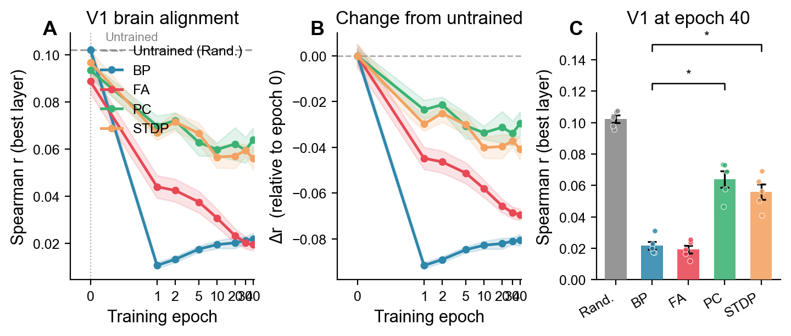

# Learning Rules RSA

> ⚠️ **Correction (August 2026).** The predictive-coding and STDP results in this repository are affected by an evaluation-mode defect: both model classes overrode `eval()` with a no-op, so their batch-normalization layers stayed in training mode during feature extraction and normalized each evaluation batch by its own statistics, while the random, backpropagation and feedback-alignment conditions used their stored running statistics. Correction notes identifying the affected results accompany the current arXiv versions of both papers; repairing the defect leaves random, backpropagation and feedback alignment unchanged to within Δρ ≤ 0.0013, changes the two affected conditions substantially, and reverses the central claim of the training-dynamics study. The full repaired five-seed re-run, and the resolution analysis that came out of it, are at **[nilsleut/evaluation-resolution-rsa](https://github.com/nilsleut/evaluation-resolution-rsa)** ([arXiv:2608.12408](https://arxiv.org/abs/2608.12408)).

Comparing biologically plausible learning rules against human fMRI using Representational Similarity Analysis (RSA).

This repository contains code, results, and figures for two related studies:

1. **Untrained CNNs Match Backpropagation at V1** (arXiv:2604.16875) — static comparison of five learning rules against THINGS-fMRI
2. **Training Degrades V1 Alignment Across Learning Rules** (in preparation) — training dynamics showing *how* and *how fast* alignment changes during learning

## Key Findings

**Paper 1:** Untrained random-weight CNNs match or exceed all trained learning rules (BP, FA, PC, STDP) at V1 alignment. V1 representational geometry is driven by architecture, not learning.

**Paper 2:** Training actively *destroys* V1 alignment — BP loses 90% after a single epoch, while biologically plausible rules (PC, STDP) preserve ~70%. An opposing trend emerges in LOC, where only BP gains alignment during training.



## Repository Structure

```
├── programs/                    # Paper 1: learning rule implementations
│   └── learning_rules_v8_kaggle.py, stats_analysis_v3.py, ...
├── figures/                     # Paper 1: figures
├── results/                     # Paper 1: RSA results (5 rules × 5 seeds)
│
├── burstprop/                   # Burstprop extension (Payeur et al. 2021)
│   ├── programs/
│   │   ├── burstprop_rsa_kaggle.py
│   │   └── burstprop_integration.py
│   ├── results/
│   └── figures/
│
└── training_dynamics/           # Paper 2: training dynamics study
    ├── programs/
    │   ├── training_dynamics_rsa.py
    │   ├── training_dynamics_analysis.py
    │   └── make_figures.py
    ├── results/
    │   └── training_dynamics_results.csv
    ├── figures/
    │   └── figure1_v1_dynamics.pdf, figure2_all_rois.pdf, ...
    └── paper/
        └── training_dynamics_paper.tex
```

## Methods

**Architecture:** 3-layer CNN (Conv 32→64→128, FC 512, CIFAR-10 classifier), shared across all learning rules.

**Learning Rules:**
- **Backpropagation (BP)** — standard supervised learning with exact gradients
- **Feedback Alignment (FA)** — fixed random feedback weights on all conv layers ([Lillicrap et al. 2016](https://doi.org/10.1038/ncomms13276))
- **Predictive Coding (PC)** — iterative inference with local prediction errors ([Rao & Ballard 1999](https://doi.org/10.1038/4580))
- **STDP** — Poisson-spike-based weight updates with exponential STDP kernel ([Masquelier & Thorpe 2007](https://doi.org/10.1371/journal.pcbi.0030031))
- **Burstprop** — burst-rate-dependent plasticity in two-compartment neurons ([Payeur et al. 2021](https://doi.org/10.1038/s41593-021-00857-x)); separate architecture (CIFAR10ConvNet)
- **Random Weights** — untrained baseline (epoch 0)

**Brain Data:** THINGS-fMRI dataset ([Hebart et al. 2023](https://doi.org/10.7554/eLife.82580)), 720 object images, 3 subjects, 6 ROIs (V1, V2, V3, V4, LOC, IT).

**RSA Pipeline:** Correlation-distance RDMs from GAP-pooled layer activations, compared to fMRI RDMs via Spearman rank correlation. Statistical testing via paired permutation tests (10,000 permutations, 5 seeds).

## Reproducing

### Paper 1 (static comparison)

```bash
# On Kaggle: add datasets "learning-rules-fmri" and "things-object-images"
# Run learning_rules_v8_kaggle.py (Save & Run All, ~4h on T4)
```

### Paper 2 (training dynamics)

```bash
# Option A: Kaggle
# Upload training_dynamics_rsa.py, Save & Run All (~3h on T4)

# Option B: Modal
pip install modal
python -m modal setup
python -m modal volume create burstprop-data
python -m modal volume put burstprop-data /path/to/outputs_720 outputs_720
python -m modal volume put burstprop-data /path/to/object_images object_images
python -m modal run training_dynamics_rsa_modal.py
python -m modal volume get training-dynamics outputs ./training_dynamics_outputs --force
```

### Burstprop extension

```bash
# On Kaggle: requires burstprop repo (auto-cloned in script)
# Run burstprop_rsa_kaggle.py (Save & Run All, ~9h on T4 for 3 seeds × 500 epochs)
```

## Results Summary

### V1 Alignment at Epoch 40 (mean ± SD across 5 seeds)

| Rule | V1 (r) | Δ from untrained |
|------|--------|------------------|
| Random (untrained) | 0.102 ± 0.005 | — |
| Predictive Coding | 0.064 ± 0.012 | −0.038 |
| STDP | 0.059 ± 0.010 | −0.043 |
| Backpropagation | 0.022 ± 0.006 | −0.080 |
| Feedback Alignment | 0.019 ± 0.006 | −0.083 |

### V1 Drop After 1 Epoch

| Rule | Drop (%) |
|------|----------|
| Backpropagation | 90% |
| Feedback Alignment | 49% |
| STDP | 31% |
| Predictive Coding | 25% |

## Citation

```bibtex
@article{leutenegger2025untrained,
  title={Untrained CNNs Match Backpropagation at V1: A Systematic RSA Comparison of Four Learning Rules Against Human fMRI},
  author={Leutenegger, Nils},
  journal={arXiv preprint arXiv:2604.16875},
  year={2025}
}
```

## License

MIT
