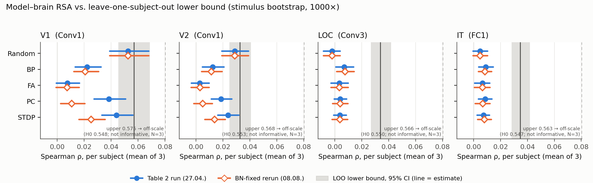

# Noise Ceiling v2 — arXiv:2604.16875

Erzeugt von `scripts/noise_ceiling_v2/step4_report.py`. Alle Zahlen stammen aus `step1_bounds.json`, `step3a_control.csv`, `step3b_sweeps.csv/.json`, `step3c_summary.csv/.json` und `step3c_bootstrap_draws.csv`, alte Textstellen aus dem TeX-Quelltext. **Paper-Dateien wurden nicht editiert.** Prüfsummen: `MANIFEST.json`.

## Kurzfassung

- Der publizierte „lower bound“ ist kein eigener Bound, sondern das 2.5. Perzentil der 1-vs-2-Split-Verteilung mit Spearman–Brown (k=2). Der Code liefert für V1 (0.036, 0.106). Die Textwerte der lower bounds (Z. 275: 0.07, 0.05, 0.03, 0.04) sind aus keinem Code reproduzierbar, ebenso V2-upper 0.09 (Code: 0.062).
- Neuer leave-one-subject-out lower bound (Nili et al. 2014), V1: 0.057 [0.045, 0.069]; V2: 0.033 [0.025, 0.041], LOC: 0.034 [0.027, 0.042], IT: 0.035 [0.028, 0.042].
- Der Nili-upper bound (V1 0.575) liegt nur 0.027 über seiner Permutations-Nullverteilung (0.548). Bei N=3 ist er **nicht informativ**.
- In derselben (Pro-Subject-)Konvention erreicht das untrainierte Netz an V1 0.053 [0.039, 0.068], Differenz zum lower bound −0.004 [−0.019, 0.010]. Die Paper-Zahl 0.0755 ist gegen die Mittel-RDM gemessen und mit keinem Bound vergleichbar.
- Pro Subject gegen den lower bound (Referenzsatz, 20 Zellen): nicht unterscheidbar 3 (Random-V1, Random-V2, STDP-V2); unter 17. Keine Bedingung liegt signifikant über der Untergrenze.
- Rangfolge der Regeln pro ROI: Mittel-RDM- vs. Pro-Subject-Konvention verschieden in 2 Fällen, alle an IT und innerhalb der Stimulus-Unsicherheit (§3b). Die geprüften qualitativen Aussagen halten.
- Tabelle 2 wird vom Referenzsatz in 17/20 Zellen auf 3 Stellen reproduziert. Die übrigen sind Rundungsfehler (§5). Der bnfix-Satz reproduziert 9/20 (BN-Fix bei PC/STDP plus neues Training).

## 1. Alte Bounds

| ROI | Code: p2.5 („lower“) | Code: Mittel („upper“) | Text Z. 275 lower | Text Z. 275 upper | Figur-Band `rsa_comparison_cnn.png` |
|---|---|---|---|---|---|
| V1 | 0.0360 | 0.1059 | 0.07 ✗ *nicht reproduzierbar* | 0.11 | 0.036–0.106 |
| V2 | 0.0187 | 0.0622 | 0.05 ✗ *nicht reproduzierbar* | 0.09 ✗ *nicht reproduzierbar* (Code 0.062) | 0.019–0.062 |
| LOC | 0.0222 | 0.0647 | 0.03 ✗ *nicht reproduzierbar* | 0.06 | 0.022–0.065 |
| IT | 0.0224 | 0.0661 | 0.04 ✗ *nicht reproduzierbar* | 0.07 | 0.022–0.066 |

**Herkunft.** `noise_ceiling()` in `learning_rules_v8.py:500-513` (gleich in allen Versionen) zieht 200-mal eine Permutation der 3 Subjects. `perm[:3//2]` ist ein einzelnes Subject, die andere Hälfte das Mittel der beiden übrigen. Es gibt also nur 3 verschiedene Splits. Auf jedes Spearman-*r* wird `2r/(1+r)` angewendet, die Spearman-Brown-Formel für **zwei gleich grosse** Hälften. Bei 1 gegen 2 Subjects gibt es kein k, das eine „Verdopplung der Testlänge“ beschreibt. Die Formel ist hier also falsch angewendet. Zurückgegeben werden `(percentile(rhos, 2.5), mean(rhos))`. Der „lower bound“ ist damit das 2.5. Perzentil **derselben** Verteilung. Weil jedes Subject in etwa einem Drittel der Ziehungen allein steht, entspricht er genau dem Split mit sub-03 allein. Er ist kein eigener Bound. Das graue Band der Figur (`learning_rules_v8.py:796`) zeigt diese beiden Zahlen unverändert. Der Text in Z. 275 weicht davon ab: lower bounds in allen ROIs, upper bound in V2. Woher die Textwerte stammen, ist nicht feststellbar (`NOISE_CEILING_PROVENANCE.md` §2, §8). Die Benennung „split-half reliability“ (Z. 228) ist ebenfalls falsch. Es werden Subjects geteilt, nicht Messwiederholungen.

## 2. Neue Bounds (Nili et al. 2014, Spearman, oberes Dreieck, ohne Spearman–Brown)

lower = mean_s ρ(RDM_s, Mittel der 2 anderen). upper = mean_s ρ(RDM_s, Mittel aller 3). CIs: Stimulus-Bootstrap, 1000×, Seed 20261002. Nullverteilung: 1000× Stimuluslabels pro Subject unabhängig permutiert, Seed 20261001.

| ROI | lower [95%-CI] | lower unter H0 | upper | upper unter H0 (Mittel ± SD) | upper − H0 | Status upper |
|---|---|---|---|---|---|---|
| V1 | 0.0570 [0.0455, 0.0688] | 0.0001 ± 0.0020 | 0.5752 | 0.5477 ± 0.0010 | 0.0275 | **bei N=3 nicht informativ** |
| V2 | 0.0326 [0.0247, 0.0407] | −0.0001 ± 0.0018 | 0.5677 | 0.5526 ± 0.0008 | 0.0151 | **bei N=3 nicht informativ** |
| LOC | 0.0339 [0.0267, 0.0418] | −0.0001 ± 0.0016 | 0.5659 | 0.5502 ± 0.0007 | 0.0157 | **bei N=3 nicht informativ** |
| IT | 0.0347 [0.0283, 0.0419] | 0.0001 ± 0.0016 | 0.5630 | 0.5468 ± 0.0007 | 0.0162 | **bei N=3 nicht informativ** |

Abgleich mit `NOISE_CEILING_PROVENANCE.md` (V1): lower 0.0570 vs. 0.057 (Δ 4.6e-05), upper 0.5752 vs. 0.5752 (Δ 1.9e-05). Beide unter 0.002, also keine Abweichung.

Paarweise Spearman-*r* zwischen den Subjects an V1: 01–02 0.1152, 01–03 0.0141, 02–03 0.0142. sub-03 teilt mit den beiden anderen fast keine RDM-Struktur, das bestimmt alle Bounds.

**Warum upper nicht informativ ist.** Jedes Subject macht ein Drittel des Mittels aus, gegen das es korreliert wird. Sind die drei Subjects unabhängig, ist ρ ≈ 1/√3 ≈ 0.577. Die Permutationsverteilung bestätigt das. Der beobachtete upper bound liegt zwar signifikant darüber, besteht aber zu 95%–97% (Nullwert/Beobachtung) aus diesem Selbst-Einschluss. Als „erreichbarer Anteil“ eignet er sich nicht. **Zulässig ist nur der Vergleich mit dem lower bound, und zwar als Untergrenze:** Ein Modell, das ihn erreicht, sagt jedes Subject so gut vorher wie die anderen Subjects. Wie weit das unter dem tatsächlich Erreichbaren liegt, ist bei N=3 unbekannt.

**Warum kein Subject-Bootstrap.** Bei n=3 gibt es nur 10 verschiedene Multimengen. 9 davon enthalten ein Subject doppelt oder dreifach, und dann wird beim leave-one-out ein Subject gegen eine Kopie von sich selbst korreliert. Der Bound wird dadurch künstlich hoch, im Extremfall (A, A, A) genau 1. Nur eine Multimenge, die Originalstichprobe, ist frei von Duplikaten. Eine solche Verteilung beschreibt keine Unsicherheit über Personen. Die CIs hier geben deshalb nur die Unsicherheit über Stimuli an (Verallgemeinerung auf neue Bilder derselben drei Personen), **nicht** über Personen.

**Warum keine within-subject Ceiling.** Jeder der 720 Stimuli wurde pro Subject genau einmal gezeigt. Für die Single-Exemplar-RDM gibt es also keine Wiederholungen, die man aufteilen könnte. Splits über Exemplare (12 pro Konzept) würden die Reliabilität einer *anderen* RDM schätzen und waren laut Entscheidung ausgeschlossen.

## 3. Modelle in derselben Konvention

ρ pro Subject = Spearman(Modell-RDM, RDM_s), gemittelt über die 3 Subjects und dann über 5 Seeds. Das ist die Konvention des lower bound. ρ Mittel-RDM = publizierte Konvention (Kontrollspalte). Differenz Modell − lower auf denselben 1000 Resamples. Kontrolle mit dem Identitäts-Sample: maximale Abweichung zu Schritt 1/3a 1e-16. Paare aus doppelt gezogenen Stimuli sind ausgeschlossen (Median 258,481 von 258,840 Paaren). Zuordnung ROI→Layer wie in Tabelle 2: V1→Conv1, V2→Conv1, LOC→Conv3, IT→FC1.

### Referenz (Tabelle-2-Lauf, outputs/model_rdms)

| Regel | ROI | ρ Mittel-RDM | Tabelle 2 | ρ pro Subject [95%-CI] | Modell − lower [95%-CI] | relativ zu lower |
|---|---|---|---|---|---|---|
| Random | V1 | 0.0755 | 0.076 | 0.0526 [0.0390, 0.0679] | −0.0045 [−0.0194, 0.0100] | nicht unterscheidbar |
| Random | V2 | 0.0433 | 0.043 | 0.0289 [0.0193, 0.0391] | −0.0037 [−0.0157, 0.0075] | nicht unterscheidbar |
| Random | LOC | −0.0051 | −0.005 | −0.0021 [−0.0085, 0.0040] | −0.0359 [−0.0454, −0.0275] | unter |
| Random | IT | 0.0078 | 0.008 | 0.0048 [−0.0005, 0.0103] | −0.0299 [−0.0391, −0.0214] | unter |
| BP | V1 | 0.0335 | 0.034 | 0.0222 [0.0134, 0.0326] | −0.0349 [−0.0488, −0.0217] | unter |
| BP | V2 | 0.0185 | 0.019 | 0.0123 [0.0048, 0.0208] | −0.0203 [−0.0310, −0.0094] | unter |
| BP | LOC | 0.0116 | 0.012 | 0.0070 [0.0007, 0.0140] | −0.0269 [−0.0364, −0.0174] | unter |
| BP | IT | 0.0133 | 0.013 | 0.0090 [0.0037, 0.0145] | −0.0257 [−0.0339, −0.0177] | unter |
| FA | V1 | 0.0117 | 0.012 | 0.0075 [−0.0007, 0.0164] | −0.0496 [−0.0647, −0.0351] | unter |
| FA | V2 | 0.0039 | 0.004 | 0.0028 [−0.0036, 0.0097] | −0.0298 [−0.0409, −0.0196] | unter |
| FA | LOC | 0.0056 | 0.006 | 0.0033 [−0.0029, 0.0099] | −0.0305 [−0.0399, −0.0220] | unter |
| FA | IT | 0.0116 | 0.012 | 0.0067 [0.0008, 0.0121] | −0.0280 [−0.0371, −0.0198] | unter |
| PC | V1 | 0.0561 | 0.056 | 0.0384 [0.0274, 0.0507] | −0.0187 [−0.0312, −0.0046] | unter |
| PC | V2 | 0.0279 | 0.028 | 0.0186 [0.0113, 0.0265] | −0.0140 [−0.0239, −0.0045] | unter |
| PC | LOC | 0.0060 | 0.006 | 0.0040 [−0.0005, 0.0087] | −0.0299 [−0.0387, −0.0218] | unter |
| PC | IT | 0.0136 | 0.014 | 0.0085 [0.0036, 0.0136] | −0.0262 [−0.0346, −0.0186] | unter |
| STDP | V1 | 0.0641 | 0.064 | 0.0440 [0.0332, 0.0562] | −0.0131 [−0.0251, −0.0003] | unter |
| STDP | V2 | 0.0358 | 0.036 | 0.0237 [0.0161, 0.0319] | −0.0089 [−0.0189, 0.0007] | nicht unterscheidbar |
| STDP | LOC | 0.0058 | 0.006 | 0.0038 [−0.0009, 0.0085] | −0.0301 [−0.0388, −0.0218] | unter |
| STDP | IT | 0.0119 | 0.012 | 0.0073 [0.0026, 0.0118] | −0.0274 [−0.0357, −0.0199] | unter |

### korrigierter Stand (bnfix, res224)

| Regel | ROI | ρ Mittel-RDM | Tabelle 2 | ρ pro Subject [95%-CI] | Modell − lower [95%-CI] | relativ zu lower |
|---|---|---|---|---|---|---|
| Random | V1 | 0.0755 | (0.076) | 0.0526 [0.0390, 0.0679] | −0.0045 [−0.0194, 0.0100] | nicht unterscheidbar |
| Random | V2 | 0.0433 | (0.043) | 0.0289 [0.0193, 0.0391] | −0.0037 [−0.0157, 0.0075] | nicht unterscheidbar |
| Random | LOC | −0.0051 | (−0.005) | −0.0021 [−0.0085, 0.0040] | −0.0359 [−0.0454, −0.0275] | unter |
| Random | IT | 0.0078 | (0.008) | 0.0048 [−0.0005, 0.0103] | −0.0299 [−0.0391, −0.0214] | unter |
| BP | V1 | 0.0314 | (0.034) | 0.0207 [0.0123, 0.0308] | −0.0364 [−0.0502, −0.0232] | unter |
| BP | V2 | 0.0169 | (0.019) | 0.0113 [0.0041, 0.0193] | −0.0213 [−0.0318, −0.0107] | unter |
| BP | LOC | 0.0126 | (0.012) | 0.0075 [0.0013, 0.0144] | −0.0264 [−0.0360, −0.0169] | unter |
| BP | IT | 0.0127 | (0.013) | 0.0083 [0.0035, 0.0135] | −0.0264 [−0.0345, −0.0184] | unter |
| FA | V1 | 0.0115 | (0.012) | 0.0073 [−0.0009, 0.0163] | −0.0497 [−0.0648, −0.0353] | unter |
| FA | V2 | 0.0040 | (0.004) | 0.0028 [−0.0036, 0.0097] | −0.0298 [−0.0408, −0.0195] | unter |
| FA | LOC | 0.0056 | (0.006) | 0.0033 [−0.0029, 0.0099] | −0.0305 [−0.0400, −0.0221] | unter |
| FA | IT | 0.0115 | (0.012) | 0.0066 [0.0007, 0.0122] | −0.0281 [−0.0373, −0.0199] | unter |
| PC | V1 | 0.0163 | (0.056) | 0.0106 [0.0025, 0.0205] | −0.0464 [−0.0616, −0.0321] | unter |
| PC | V2 | 0.0075 | (0.028) | 0.0050 [−0.0017, 0.0122] | −0.0276 [−0.0385, −0.0171] | unter |
| PC | LOC | 0.0062 | (0.006) | 0.0039 [−0.0017, 0.0097] | −0.0300 [−0.0387, −0.0216] | unter |
| PC | IT | 0.0109 | (0.014) | 0.0068 [0.0012, 0.0122] | −0.0279 [−0.0366, −0.0194] | unter |
| STDP | V1 | 0.0372 | (0.064) | 0.0252 [0.0161, 0.0356] | −0.0319 [−0.0460, −0.0187] | unter |
| STDP | V2 | 0.0207 | (0.036) | 0.0138 [0.0066, 0.0218] | −0.0188 [−0.0291, −0.0084] | unter |
| STDP | LOC | 0.0057 | (0.006) | 0.0037 [−0.0020, 0.0095] | −0.0301 [−0.0395, −0.0215] | unter |
| STDP | IT | 0.0131 | (0.012) | 0.0080 [0.0030, 0.0131] | −0.0266 [−0.0355, −0.0191] | unter |

„relativ zu lower“: *über*/*unter* heisst, dass das 95%-CI der Differenz die 0 nicht enthält. Bei bnfix steht der publizierte Wert in Klammern, weil er aus einem anderen Lauf stammt.

### 3b. Rangfolge und qualitative Aussagen

| RDM-Satz | ROI | Rangfolge Mittel-RDM | Rangfolge pro Subject | gleich? |
|---|---|---|---|---|
| original | V1 | Random > STDP > PC > BP > FA | Random > STDP > PC > BP > FA | ja |
| original | V2 | Random > STDP > PC > BP > FA | Random > STDP > PC > BP > FA | ja |
| original | LOC | BP > PC > STDP > FA > Random | BP > PC > STDP > FA > Random | ja |
| original | IT | PC > BP > STDP > FA > Random | BP > PC > STDP > FA > Random | **nein** |
| bnfix | V1 | Random > STDP > BP > PC > FA | Random > STDP > BP > PC > FA | ja |
| bnfix | V2 | Random > STDP > BP > PC > FA | Random > STDP > BP > PC > FA | ja |
| bnfix | LOC | BP > PC > STDP > FA > Random | BP > PC > STDP > FA > Random | ja |
| bnfix | IT | STDP > BP > FA > PC > Random | BP > STDP > PC > FA > Random | **nein** |

Paarweise Differenzen pro Subject im Referenzsatz, Stimulus-Bootstrap-CI auf denselben Resamples. Das ersetzt nicht die Permutations- und FDR-Tests des Papers, sondern prüft nur, ob das Vorzeichen in der neuen Konvention hält.

| Aussage | Δρ pro Subject | 95%-CI | hält? |
|---|---|---|---|
| Random > BP an V1 | 0.0304 | [0.0184, 0.0424] | ja |
| Random > BP an V2 | 0.0166 | [0.0074, 0.0260] | ja |
| BP > Random an LOC | 0.0090 | [0.0010, 0.0180] | ja |
| BP − FA an LOC (Paper: n.s.) | 0.0036 | [−0.0015, 0.0093] | CI enthält 0 (konsistent mit n.s.) |
| BP − PC an LOC (Paper: n.s.) | 0.0030 | [−0.0044, 0.0107] | CI enthält 0 (konsistent mit n.s.) |
| BP − STDP an LOC (Paper: n.s.) | 0.0032 | [−0.0031, 0.0101] | CI enthält 0 (konsistent mit n.s.) |

Paare, deren Reihenfolge zwischen den Konventionen wechselt (Δρ pro Subject, Bootstrap-CI):

| RDM-Satz | ROI | Paar | Δρ pro Subject | 95%-CI | aufgelöst? |
|---|---|---|---|---|---|
| original | IT | BP − PC | 0.0005 | [−0.0056, 0.0064] | nein (CI enthält 0) |
| bnfix | IT | BP − STDP | 0.0003 | [−0.0045, 0.0049] | nein (CI enthält 0) |
| bnfix | IT | PC − FA | 0.0001 | [−0.0036, 0.0036] | nein (CI enthält 0) |

Alle Wechsel betreffen nur IT; sie liegen innerhalb der Stimulus-Unsicherheit und passen zur Konvergenz-Aussage des Papers.

**„FA consistently produces the lowest alignment at V1, V2, and LOC“** (Abstract Z. 42): niedrigste Bedingung in der publizierten Konvention: V1: FA, V2: FA, LOC: Random; pro Subject: V1: FA, V2: FA, LOC: Random; nur unter den trainierten Regeln: V1: FA, V2: FA, LOC: FA. Die Aussage stimmt an LOC **schon in Tabelle 2 nicht**, dort ist Random am niedrigsten. Sie gilt nur unter den trainierten Regeln. Das hat mit der Konvention nichts zu tun; ich vermerke es nur. IT-Konvergenz: ρ pro Subject zwischen 0.0048 und 0.0090.

## 4. Figur



Punkte: ρ pro Subject mit 95%-CI. Gefüllt = Referenzsatz, hohl = bnfix. Graues Band: 95%-CI des LOO lower bound, Linie = Schätzer. Der upper bound liegt ausserhalb der Skala und ist am rechten Rand gestrichelt mit seinem Nullwert angegeben.

## 5. Rundungsfehler in Tabelle 2

| Regel | ROI | TeX-Zeile | Wert (CSV/RDMs) | gedruckt | korrekt (3 Stellen) | über 4 Stellen gerundet |
|---|---|---|---|---|---|---|
| BP | V1 | 299 | 0.03346 | 0.034 | **0.033** | 0.034 |
| BP | V2 | 300 | 0.01846 | 0.019 | **0.018** | 0.019 |
| Random | V1 | 299 | 0.07546 | 0.076 | **0.075** | 0.076 |

Alle 3 Abweichungen entstehen durch doppeltes Runden (erst auf 4, dann auf 3 Stellen). Die Werte selbst sind korrekt. Siehe `NUMERIC_AUDIT.md` Zeilen 10–14 (dort auch V2-BP-CI .023 → .022 und dieselben Zahlen in Abstract und Diskussion: Z. 42, 279, 285, 299, 398, 402) sowie dasselbe Muster in arXiv:2608.12408 (Zeile 1).

## 6. Sweep-Provenienz

| Sweep | Datei | Datum | Seeds | Skript | Konfiguration |
|---|---|---|---|---|---|
| table | `outputs/rsa_results_seeds.csv` | 2026-04-27 05:14 | 5 (42, 123, 456, 789, 1337) | learning_rules_v8.py (Kaggle notebook learning_rules_v8.ipynb, T4) | N_EPOCHS=40, BATCH=64, LR=1e-3, N_CIFAR=8000; CIFAR subset drawn once with seed 42 and shared by all seeds (learning_rules_v8.py:987-992); num_workers=0; pre-BN-fix |
| june_sweep | `outputs/rsa_resolution_sweep.csv` | 2026-06-05 07:38 | 5 (42, 123, 456, 789, 1337) | learning_rules_v9_sweep_modal.py, June version (copy: Projekte_2/merged_paper/learning_rules_v9_sweep_modal.py, 2026-06-04) | N_EPOCHS=40, BATCH=128, LR=1e-3, N_CIFAR=8000; CIFAR subset re-drawn per seed (manual_seed(seed) before randperm); num_workers=4; Modal T4; pre-BN-fix; retrained from scratch |
| bnfix | `learning_rules_outputs_bnfix/rsa_resolution_sweep.csv` | 2026-08-08 17:35 | 5 (42, 123, 456, 789, 1337) | learning_rules_v10_sweep_modal.py (= v9 August version + merge check) | as june_sweep, plus BN-mode fix for PC/STDP and explicit train/eval mode per phase; retrained from scratch |

Duplikate: `old_sweep.csv` ist byte-identisch mit `outputs/rsa_resolution_sweep.csv`; `bnfix_sweep.csv` ist byte-identisch mit `learning_rules_outputs_bnfix/rsa_resolution_sweep.csv`. **„Alt“ = 0.0308** ist BP Conv1→V1 bei 224 px im Juni-Sweep (`outputs/rsa_resolution_sweep.csv`, kopiert als `old_sweep.csv`). Das ist ein eigenes Neutraining, nicht der Lauf hinter Tabelle 2. Alle Werte bei 224 px in Mittel-RDM-Konvention.

| Regel | ROI | Tabelle (Mittel ± SD) | Juni-Sweep | bnfix | Tabelle − bnfix | 2 SE | z | innerhalb 2 SE |
|---|---|---|---|---|---|---|---|---|
| Backprop | V1 | 0.0335 ± 0.0067 | 0.0308 ± 0.0072 | 0.0314 ± 0.0069 | 0.0020 | 0.0086 | 0.48 | ja |
| Backprop | V2 | 0.0185 ± 0.0048 | 0.0165 ± 0.0042 | 0.0169 ± 0.0040 | 0.0016 | 0.0056 | 0.56 | ja |
| Backprop | LOC | 0.0116 ± 0.0010 | 0.0127 ± 0.0010 | 0.0126 ± 0.0007 | −0.0010 | 0.0011 | -1.76 | ja |
| Backprop | IT | 0.0133 ± 0.0017 | 0.0134 ± 0.0017 | 0.0127 ± 0.0009 | 0.0006 | 0.0017 | 0.68 | ja |
| Feedback Alignment | V1 | 0.0117 ± 0.0080 | 0.0119 ± 0.0070 | 0.0115 ± 0.0068 | 0.0002 | 0.0094 | 0.04 | ja |
| Feedback Alignment | V2 | 0.0039 ± 0.0032 | 0.0042 ± 0.0026 | 0.0040 ± 0.0024 | −0.0000 | 0.0036 | -0.02 | ja |
| Feedback Alignment | LOC | 0.0056 ± 0.0007 | 0.0056 ± 0.0007 | 0.0056 ± 0.0007 | 0.0000 | 0.0009 | 0.00 | ja |
| Feedback Alignment | IT | 0.0116 ± 0.0008 | 0.0115 ± 0.0009 | 0.0115 ± 0.0008 | 0.0001 | 0.0010 | 0.18 | ja |
| Random Weights | V1 | 0.0755 ± 0.0083 | 0.0755 ± 0.0083 | 0.0755 ± 0.0083 | −0.0000 | 0.0105 | -0.00 | ja |
| Random Weights | V2 | 0.0433 ± 0.0052 | 0.0433 ± 0.0052 | 0.0433 ± 0.0052 | 0.0000 | 0.0065 | 0.00 | ja |
| Random Weights | LOC | −0.0051 ± 0.0024 | −0.0051 ± 0.0024 | −0.0051 ± 0.0024 | −0.0000 | 0.0031 | -0.00 | ja |
| Random Weights | IT | 0.0078 ± 0.0029 | 0.0078 ± 0.0029 | 0.0078 ± 0.0029 | 0.0000 | 0.0037 | 0.00 | ja |

Keine Zelle liegt ausserhalb von 2 SE. SE = Seed-SD/√5 pro Sweep, kombiniert als √(SE₁² + SE₂²). Das setzt unabhängig trainierte Sweeps voraus. Random ist deterministisch und in allen drei Sweeps bit-identisch (Differenz 0).

**Korrekturnotiz Z. 61–63 („Δρ ≤ 0.0013 at V1 across six evaluation resolutions“).** Die Zahl ist korrekt, aber sie vergleicht Juni-Sweep mit bnfix: Maximum 0.0013 bei Backprop, 32 px. Gegen Tabelle 2 beträgt die Differenz bei 224 px bis zu 0.0020 (BP V1: 0.0335 → 0.0314). Die Notiz liest sich aber so, als bezöge sie sich auf die Werte des Papers. (Die Stelle steht in Z. 61–63, nicht in Z. 87–92.)

## 7. Textänderungen `learning_rules_rsa_paper_v2.tex` (Vorschläge, nicht angewendet)

**Z. 60–63** — Vergleich gegen die Tabelle statt Sweep gegen Sweep, mit Seed-Streuung

Alt:
```latex
Repairing the defect and re-running the full five-seed design leaves the random,
backpropagation and feedback-alignment conditions unchanged to within
$\Delta\rho \le 0.0013$ at V1 across six evaluation resolutions, and reproduces the
untouched random condition bit-identically. It changes the two affected conditions
```
Neu:
```latex
Repairing the defect and re-running the full five-seed design (newly trained models)
leaves the random, backpropagation and feedback-alignment conditions within seed
variability of Table~\ref{tab:rsa}: at $224$\,px the largest change is
$\Delta\rho = -0.0020$ for backpropagation at V1
($0.0335 \to 0.0314$; seed SD $0.0067$ and
$0.0069$), and all twelve rule\,$\times$\,ROI differences are below two
standard errors across seeds. The untouched random condition is reproduced
bit-identically. It changes the two affected conditions
```

**Z. 87–94** — ganzer Absatz ersetzt durch die Correction note (v3), siehe §9; „exhaust most of the available signal“ ersatzlos gestrichen

Alt:
```latex
\noindent\textbf{On the noise-ceiling argument.} Section~4.2 argues that because all
conditions lie within or near the split-half noise ceiling, they exhaust most of the
available signal. That is true and less reassuring than it reads: a single scalar
luminance value per image reaches $\rho = 0.075$ against the same V1 RDM, essentially
matching the untrained network's $0.076$ (\newid). The luminance figure involves no
model and no readout, so it bounds the brain side directly; the models' figures are
specific to rank correlation on globally pooled features. Occupying most of the
resolvable signal at V1 under this comparison is a low bar.
```
Neu:
```latex
\noindent\textbf{Noise ceiling (v3).} The noise ceiling reported in v1 and v2
(Section~3.4, Figure~\ref{fig:rsa_main}, Section~4.2) was computed incorrectly: the three
subjects were split one against two, a Spearman--Brown correction valid only for two
equal halves was applied, and the 2.5th percentile of the resulting split distribution
was reported as the lower bound. The lower bounds stated in Section~4.2, and the V2
upper bound, do not correspond to any computed value. We replace it with the
leave-one-subject-out lower bound \citep{nili2014} (V1: $0.057$ [0.045, 0.069], V2: $0.033$ [0.025, 0.041], LOC: $0.034$ [0.027, 0.042], IT: $0.035$ [0.028, 0.042]; 95\% stimulus-bootstrap
CIs) and compare models to it in the same per-subject convention (Fig.~\ref{fig:nc}):
the untrained network reaches $\rho = 0.053$ at V1, and
the ranking of the conditions within each ROI is unchanged under this convention at V1, V2 and LOC; at IT, where all conditions converge, adjacent conditions whose difference is not resolved swap places. The statement that
the conditions exhaust most of the available signal is withdrawn; with three subjects,
no informative upper bound exists. Independently, a single scalar luminance value per
image reaches $\rho = 0.075$ against the group-mean V1 RDM (\newid), so V1 alignment at
this level is a low bar. Three values in Table~\ref{tab:rsa} were rounded
twice and are corrected
(BP at V1: $0.033$; BP at V2: $0.018$; Random at V1: $0.075$).
```

**Z. 228**

Alt:
```latex
\textbf{Noise ceiling.} Upper and lower bounds were estimated using split-half reliability corrected by the Spearman--Brown formula \citep{kriegeskorte2008}.
```
Neu:
```latex
\textbf{Noise ceiling.} We report a lower bound on the attainable model--brain
correlation as the inter-subject consistency of \citet{nili2014}: each subject's RDM
is correlated (Spearman, upper triangle) with the mean RDM of the other two subjects,
and the three values are averaged; no Spearman--Brown correction is applied. 95\% CIs
are from 1,000 stimulus bootstrap resamples (pairs of a resampled stimulus
with itself excluded); with $N = 3$ subjects no subject-level interval is reported.
Because each stimulus was presented once per subject, a within-subject reliability of
these single-exemplar RDMs cannot be estimated. The corresponding upper bound
(correlation with the mean including the subject) is not reported: with three subjects
it is dominated by each subject's own contribution to the mean
(V1: 0.575 observed vs.\ 0.548 under
stimulus permutation).
```

**Z. 271** — graues Band entfernen; neue Figur `fig:nc` = noise_ceiling_v2.pdf

Alt:
```latex
\caption{Brain alignment across ROIs (main result). Spearman $\rho$ between model RDMs and mean fMRI RDMs (3 subjects) for each condition and ROI. Error bars: bootstrap 95\% CI ($N = 10{,}000$). Grey hatched band: noise ceiling (Spearman--Brown corrected split-half); white bar with black outline: untrained random-weights baseline.}
```
Neu:
```latex
\caption{Brain alignment across ROIs (main result). Spearman $\rho$ between model RDMs
and the mean fMRI RDM (3 subjects) for each condition and ROI. Error bars: bootstrap
95\% CI ($N = 10{,}000$). White bar with black outline: untrained random-weights
baseline. No noise ceiling is drawn: no bound is available for the group-mean
convention with three subjects (see Fig.~\ref{fig:nc} for the per-subject comparison
with the leave-one-out lower bound).}
```

**Z. 275** — „Critically … noise level“ ersetzt, Vergleich nur mit lower bound als Untergrenze

Alt:
```latex
\textbf{Interpreting absolute RSA scores.} Absolute Spearman $\rho$ values in this study are low (e.g., $\rho < 0.10$ at V1), which may appear surprising in light of Brain-Score results where encoding models reach $\rho \approx 0.5$ for V1. However, RSA and encoding models measure fundamentally different quantities: RSA evaluates the geometry of the representational space (pairwise dissimilarity structure), whereas encoding models predict individual voxel responses, which is a more permissive criterion that can exploit stimulus-specific variance. RSA scores are further attenuated by the spatial resolution of fMRI relative to electrophysiology, and by our relatively small CNN architecture. Critically, all conditions lie within or near the noise ceiling (upper bounds: V1: 0.11, V2: 0.09, LOC: 0.06, IT: 0.07; lower bounds: 0.07, 0.05, 0.03, 0.04), confirming that our conditions exhaust most of the available signal given the fMRI noise level. Typical RSA Spearman $\rho$ values in the literature range from 0.01 to 0.15 for model--fMRI comparisons at this scale \citep{kriegeskorte2008, schrimpf2020}.
```
Neu:
```latex
\textbf{Interpreting absolute RSA scores.} Absolute Spearman $\rho$ values in this study
are low (e.g., $\rho < 0.10$ at V1), which may appear surprising in light of Brain-Score
results where encoding models reach $\rho \approx 0.5$ for V1. However, RSA and encoding
models measure fundamentally different quantities: RSA evaluates the geometry of the
representational space (pairwise dissimilarity structure), whereas encoding models
predict individual voxel responses, which is a more permissive criterion that can
exploit stimulus-specific variance. RSA scores are further attenuated by the spatial
resolution of fMRI relative to electrophysiology, and by our relatively small CNN
architecture. The inter-subject agreement is itself low: the leave-one-subject-out lower
bound is V1: $0.057$ [0.045, 0.069], V2: $0.033$ [0.025, 0.041], LOC: $0.034$ [0.027, 0.042], IT: $0.035$ [0.028, 0.042]. Compared per subject, the untrained network at V1
($\rho = 0.053$) is indistinguishable from this bound
(difference $-0.004$
[-0.019,
0.010]), i.e.\ it predicts a held-out
subject about as well as the other subjects do. This is a floor on the attainable
correlation, not an estimate of it; with three subjects the remaining headroom cannot be
quantified (Fig.~\ref{fig:nc}). Typical RSA Spearman $\rho$ values in the literature
range from 0.01 to 0.15 for model--fMRI comparisons at this scale
\citep{kriegeskorte2008, schrimpf2020}.
```

**Z. 400** — nur der letzte Satz ändert sich; „upper bound: 0.07“ entfällt

Alt:
```latex
\textbf{Learning rules converge at higher areas.} At LOC, only BP significantly exceeds the random baseline, but differences among trained rules are small and non-significant after FDR correction. At IT, all five conditions converge completely. This convergence may reflect a genuine property of abstract categorical representations, but is also consistent with a capacity limitation: our small CNN trained on 8,000 CIFAR-10 samples may simply lack the representational power to differentiate at higher layers. Prior work with larger models suggests that BP-trained networks have a systematic IT advantage \citep{schrimpf2020}; whether this advantage reflects the learning rule or the additional model capacity remains an open question. We note that the noise ceiling at IT is also the lowest of all ROIs (upper bound: 0.07), leaving limited room for any condition to differentiate --- it is possible that true differences exist but are unresolvable given the fMRI signal quality at this ROI and sample size ($N = 3$).
```
Neu:
```latex
... whether this advantage reflects the learning rule or the additional model capacity
remains an open question. The leave-one-subject-out lower bound at IT
($0.035$) is not the lowest of the four ROIs (lowest: V2, $0.033$),
so the convergence at IT is not explained by a lower ceiling there. All conditions lie
well below it at IT (per-subject $\rho \le 0.009$), so true differences may exist
that are unresolvable given the fMRI signal quality at this ROI and sample size ($N = 3$).
```

## 8. arXiv:2608.12408 (Evaluation Resolution Confounds)

**`Evaluation_Resolution_Confounds_paper.tex:57`**

Alt (Satzanfang):
```latex
\textbf{Interpreting the scale.} Absolute Spearman $\rho$ values in this setting are low. The endpoint study estimated split-half noise ceilings on the same fMRI data of $0.11$ at V1 and $0.06$ at LOC (upper bounds; lower bounds $0.07$ and $0.03$) \citep{leutenegger2026}, so the untrained network's $\rho = 0.076$ at $224$\,px is roughly $69\%$ of the attainable ceiling at V1. That framing should be read with the caveat established in \S3.4: a single scalar luminance value per image also reaches $\rho = 0.075$ at V1 in this dataset. That number is a prope …
```
Neu (ersetzt die ersten beiden Sätze, Rest des Absatzes ab „That framing …“ unverändert, mit „framing“ → „comparison“):
```latex
\textbf{Interpreting the scale.} Absolute Spearman $\rho$ values in this setting are low.
The split-half noise ceiling quoted in v1 of this paper has been withdrawn by the endpoint
study \citep{leutenegger2026}. Its replacement, a leave-one-subject-out lower bound
(V1: $0.057$ [0.045, 0.069]; LOC: $0.034$),
is a per-subject quantity; the untrained network's per-subject score at $224$\,px is
$\rho = 0.053$, statistically indistinguishable from that floor. No bound exists for the group-mean
convention of our figures ($\rho = 0.075$ at $224$\,px),
so we give no percentage of a ceiling.
```

Nebenbei: Die Zeile nennt untrainiert ρ = 0.076. Korrekt gerundet ist 0.075 (`NUMERIC_AUDIT.md` Zeile 1).

**`Evaluation_Resolution_Confounds_paper_v2.tex:35`, Prüfung der Formulierung**

Ist:
```latex
We also withdraw the noise-ceiling estimate and the ``$69\%$ of the attainable ceiling'' figure. With three subjects and single-presentation stimuli, neither a within-subject nor a between-subject ceiling is estimable on these data. The luminance bound, which requires no ceiling, is stated in its place; it is the bound the paper's scale argument now rests on.
```
Das ist **nicht präzise**:
1. Eine between-subject Untergrenze *ist* schätzbar, sie wird hier berechnet (V1 0.057 [0.045, 0.069]). Nicht schätzbar bzw. nicht informativ ist bei N=3 die *obere* Grenze.
2. Dass keine within-subject Ceiling schätzbar ist, gilt für **genau diese Single-Exemplar-RDM**, weil jeder Stimulus einmal gezeigt wurde. Für THINGS-fMRI allgemein gilt es nicht: Das Testset hat 12 Wiederholungen, die Trainingsbilder haben 12 Exemplare pro Konzept.
3. Für die Mittel-RDM-Konvention der Figuren gibt es keinen Bound, auch keinen between-subject.

Vorschlag:
```latex
We also withdraw the noise-ceiling estimate and the ``$69\%$ of the attainable ceiling''
figure. Because each of the 720 stimuli was presented once per subject, no within-subject
ceiling can be estimated for the single-exemplar RDMs used here, and with three subjects
no ceiling is available for the group-mean RDM our figures correlate against. A
between-subject lower bound can be computed for per-subject scores
(V1: $0.057$; \citealp{leutenegger2026}), but it is a floor, not a ceiling.
The luminance bound, which requires no ceiling, is stated in its place; it is the bound
the paper's scale argument now rests on.
```

## 9. arXiv-Revisionskommentar und Correction note

**arXiv comment (v3), 3 Sätze:**

> v3 withdraws the noise ceiling of v1/v2, which applied a two-half Spearman-Brown correction to an unequal 1-vs-2 subject split and reported a percentile of that split distribution as its lower bound (the printed lower bounds were not reproducible). It is replaced by the leave-one-subject-out lower bound of Nili et al. (2014) with stimulus-bootstrap CIs, compared against per-subject model scores, and the claim that the models exhaust the available signal is removed. No qualitative result changes; three double-rounding errors in Table 2 are also corrected.

**Correction note (v3):** Das ist der Absatz, der in §7 Z. 87–94 ersetzt („On the noise-ceiling argument“ → „Noise ceiling (v3)“). Er steht dort einmal, damit derselbe Inhalt nicht doppelt in der Notiz auftaucht:

```latex
\noindent\textbf{Noise ceiling (v3).} The noise ceiling reported in v1 and v2
(Section~3.4, Figure~\ref{fig:rsa_main}, Section~4.2) was computed incorrectly: the three
subjects were split one against two, a Spearman--Brown correction valid only for two
equal halves was applied, and the 2.5th percentile of the resulting split distribution
was reported as the lower bound. The lower bounds stated in Section~4.2, and the V2
upper bound, do not correspond to any computed value. We replace it with the
leave-one-subject-out lower bound \citep{nili2014} (V1: $0.057$ [0.045, 0.069], V2: $0.033$ [0.025, 0.041], LOC: $0.034$ [0.027, 0.042], IT: $0.035$ [0.028, 0.042]; 95\% stimulus-bootstrap
CIs) and compare models to it in the same per-subject convention (Fig.~\ref{fig:nc}):
the untrained network reaches $\rho = 0.053$ at V1, and
the ranking of the conditions within each ROI is unchanged under this convention at V1, V2 and LOC; at IT, where all conditions converge, adjacent conditions whose difference is not resolved swap places. The statement that
the conditions exhaust most of the available signal is withdrawn; with three subjects,
no informative upper bound exists. Independently, a single scalar luminance value per
image reaches $\rho = 0.075$ against the group-mean V1 RDM (\newid), so V1 alignment at
this level is a low bar. Three values in Table~\ref{tab:rsa} were rounded
twice and are corrected
(BP at V1: $0.033$; BP at V2: $0.018$; Random at V1: $0.075$).
```

Neue Literaturangabe für die `thebibliography`-Umgebung (Z. 428–500), alphabetisch einsortieren:
```latex
\bibitem[Nili et al., 2014]{nili2014}
Nili, H., Wingfield, C., Walther, A., Su, L., Marslen-Wilson, W., and Kriegeskorte, N. (2014).
A toolbox for representational similarity analysis.
\textit{PLoS Computational Biology}, 10(4):e1003553.
```

## 10. Dateien und Reproduktion

```
py -3 scripts/noise_ceiling_v2/step1_nili_bounds.py      # Bounds, Permutationsnull, alter Schätzer
py -3 scripts/noise_ceiling_v2/step3a_control_column.py   # Kontrollspalte (Reproduktion Tabelle 2)
py -3 scripts/noise_ceiling_v2/step3b_sweep_provenance.py # Sweep-Provenienz
py -3 scripts/noise_ceiling_v2/step3c_bootstrap.py        # 1000× Stimulus-Bootstrap (~25 min, 10 Prozesse)
py -3 scripts/noise_ceiling_v2/step4_figure.py
py -3 scripts/noise_ceiling_v2/step4_report.py
py -3 scripts/noise_ceiling_v2/step4_manifest.py          # erst nach Commit der Skripte
```

Seeds: Permutationen 20261001, Bootstrap 20261002 (SHA-256 der Indexmatrix `ebd87ae6da1d7c50…`). Laufzeit Bootstrap 28 min.
