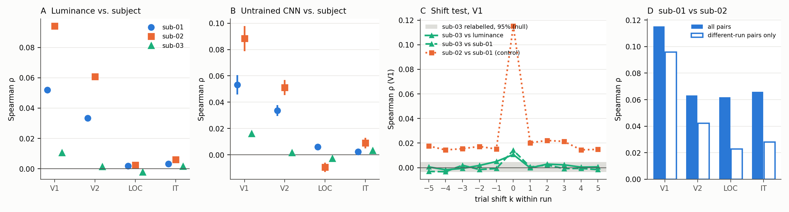

# sub-03-Integritätscheck (vor Noise-Ceiling v3)

**Verdikt: (B) Kein Zuordnungsfehler: sub-03 hat echt schwächeres Signal (die vom Datensatz mitgelieferte Voxel-Reliabilität aus 12× wiederholten Testbildern ist in allen ROIs die niedrigste, Check 6). Der Abstand zu sub-01/02 wird aber durch eine **gemeinsame Präsentationsreihenfolge von sub-01 und sub-02** vergrößert (Check 8), und das betrifft die noise-ceiling-v2-Bounds.**

Erzeugt von `scripts/sub03_check/report.py` aus den CSV/JSON in `results/sub03_check/`. Paper-Dateien und `results/noise_ceiling_v2/` wurden nicht verändert.

## Kurzfassung

- **Zuordnung:** Stimulusliste, Metadatenzeile→H5-Spalte und Voxel-Metadaten→H5-Zeile sind bei allen drei Subjects korrekt (Check 4). Die Rohdaten-Rekonstruktion trifft die gespeicherten RDMs auf 2.2e-08 genau.
- **Kein Off-by-k:** Im Verschiebungstest hat sub-03 das Maximum gegen sub-01 in allen ROIs bei k = 0, gegen Luminanz an V1 (der einzigen ROI mit Luminanzsignal bei sub-03). An V1 liegt ρ(sub-03, Luminanz) = 0.0107 bei z = 5.1, ρ(sub-03, sub-01) = 0.0141 bei z = 7.0 gegen 1000 zufällige Zuordnungen. Das Signal ist schwach, aber eindeutig stimulusgebunden.
- **Echt schwächer:** Die Reliabilität aus dem Datensatz selbst (`nc_testset`, aus Testbild-Wiederholungen, ohne unsere Pipeline) beträgt an V1 sub-01 25.7, sub-02 25.1, sub-03 15.5. sub-03 hat weniger Voxel (V1: 1049, 1104, 839). Auch zwischen seinen eigenen 12 Sessions ist sub-03 am wenigsten konsistent (Check 7). Seine Session 5 ist dabei kein Ausreißer.
- **Neuer Befund, Reihenfolge:** sub-01 (Session 3) und sub-02 (Session 2) sahen die 720 Stimuli in **identischer** Reihenfolge, sub-03 (Session 5) in einer anderen. Jede Subject-RDM enthält eine starke Run-Komponente. Auf Paare aus verschiedenen Runs beschränkt sinkt sub-01↔sub-02 von V1 0.115→0.096, V2 0.063→0.042, LOC 0.062→0.023, IT 0.066→0.028. Ein Teil der hohen 01–02-Übereinstimmung, besonders an LOC und IT, ist also reihenfolgebedingt und nicht stimulusbedingt.

## Check 1: Subject–Subject (gespeicherte RDMs, oberes Dreieck)

| ROI | 01–02 Spearman | 01–03 | 02–03 | 01–02 Pearson | 01–03 | 02–03 |
|---|---|---|---|---|---|---|
| V1 | 0.1152 | 0.0141 | 0.0142 | 0.1259 | 0.0121 | 0.0136 |
| V2 | 0.0633 | 0.0074 | 0.0056 | 0.0682 | 0.0085 | 0.0050 |
| LOC | 0.0618 | 0.0076 | 0.0090 | 0.0686 | 0.0098 | 0.0109 |
| IT | 0.0659 | 0.0086 | 0.0074 | 0.0718 | 0.0080 | 0.0083 |

Das Muster (sub-03 ≈ 0.01 gegen beide, 01–02 5- bis 8-mal höher) ist in allen vier ROIs gleich und hängt nicht vom Korrelationsmaß ab.

## Check 2: Luminanz pro Subject

Luminanz = Rec.-709-Mittelwert pro Bild mit `colour_statistic_control.py` (Bildsuche, Laden, |Δ|-RDM wiederverwendet). 720/720 Bilder wurden über den exakten Dateinamen gefunden, der Konzept-Fallback in `find_img` griff nie. Kontrolle: ρ(Luminanz, Mittel-RDM, V1) = 0.0745, wie im Paper (0.074/0.075).

| ROI | sub-01 | sub-02 | sub-03 | Mittel-RDM | sub-03 / Mittel(01,02) |
|---|---|---|---|---|---|
| V1 | 0.0520 | 0.0940 | 0.0107 | 0.0745 | 0.15 |
| V2 | 0.0335 | 0.0608 | 0.0015 | 0.0476 | 0.03 |
| LOC | 0.0019 | 0.0024 | −0.0021 | −0.0003 | – (kein Signal bei 01/02) |
| IT | 0.0032 | 0.0061 | 0.0017 | 0.0053 | – (kein Signal bei 01/02) |

An V1 ist sub-03 klein, aber über der Nullverteilung (95 %-Grenze 0.0046). Das spricht gegen eine Fehlzuordnung: Ein vertauschtes Bild hätte keine Luminanzbeziehung. Gegen schwaches Signal spricht es nicht. An LOC und IT trägt Luminanz bei keinem Subject Information.

## Check 3: Modelle pro Subject (Referenzsatz, Mittel ± SD über 5 Seeds)

Werte aus `results/noise_ceiling_v2/step3a_control_per_seed.csv` (pro Subject und Seed bereits berechnet, nur gelesen).

| Regel | ROI | sub-01 | sub-02 | sub-03 |
|---|---|---|---|---|
| Random | V1 | 0.0533 ± 0.0073 | 0.0883 ± 0.0095 | 0.0161 ± 0.0015 |
| Random | V2 | 0.0337 ± 0.0042 | 0.0511 ± 0.0058 | 0.0018 ± 0.0006 |
| Random | LOC | 0.0060 ± 0.0009 | −0.0095 ± 0.0036 | −0.0027 ± 0.0006 |
| Random | IT | 0.0024 ± 0.0011 | 0.0089 ± 0.0040 | 0.0032 ± 0.0012 |
| BP | V1 | 0.0212 ± 0.0052 | 0.0372 ± 0.0071 | 0.0082 ± 0.0017 |
| BP | V2 | 0.0118 ± 0.0037 | 0.0223 ± 0.0057 | 0.0027 ± 0.0005 |
| BP | LOC | 0.0069 ± 0.0007 | 0.0096 ± 0.0019 | 0.0044 ± 0.0004 |
| BP | IT | 0.0128 ± 0.0018 | 0.0089 ± 0.0024 | 0.0052 ± 0.0008 |
| FA | V1 | 0.0023 ± 0.0076 | 0.0162 ± 0.0069 | 0.0038 ± 0.0018 |
| FA | V2 | −0.0002 ± 0.0040 | 0.0086 ± 0.0021 | 0.0001 ± 0.0003 |
| FA | LOC | 0.0062 ± 0.0010 | 0.0047 ± 0.0007 | −0.0009 ± 0.0004 |
| FA | IT | 0.0083 ± 0.0011 | 0.0093 ± 0.0012 | 0.0024 ± 0.0005 |
| PC | V1 | 0.0410 ± 0.0073 | 0.0615 ± 0.0123 | 0.0127 ± 0.0028 |
| PC | V2 | 0.0230 ± 0.0041 | 0.0317 ± 0.0074 | 0.0010 ± 0.0008 |
| PC | LOC | 0.0082 ± 0.0012 | 0.0026 ± 0.0013 | 0.0011 ± 0.0005 |
| PC | IT | 0.0116 ± 0.0013 | 0.0099 ± 0.0034 | 0.0039 ± 0.0013 |
| STDP | V1 | 0.0471 ± 0.0076 | 0.0729 ± 0.0131 | 0.0120 ± 0.0018 |
| STDP | V2 | 0.0269 ± 0.0046 | 0.0426 ± 0.0094 | 0.0016 ± 0.0009 |
| STDP | LOC | 0.0084 ± 0.0020 | 0.0026 ± 0.0016 | 0.0003 ± 0.0007 |
| STDP | IT | 0.0098 ± 0.0023 | 0.0083 ± 0.0031 | 0.0038 ± 0.0010 |

Positive Mittelwerte (von 20): sub-01 19, sub-02 19, sub-03 18. sub-03 ist nicht für alle Modelle ≈ 0. An V1 liegt es für Random, PC und STDP klar über 0, nur kleiner als bei sub-01/02.

## Check 4: Stimulus-IDs und Zuordnung

**Quelle der Reihenfolge** (`extract_fmri_rdms_720.py`): `outputs_720/stim_order_{sub}.txt` wird geladen (Z. 82–86). Fehlt die Datei, wird sie neu berechnet (Z. 88–101): pro Konzept alphabetisch, davon das erste Exemplar nach Dateinamen. Die Response eines Stimulus ist `responses_all[stim.index[stim.stimulus == s]]` (Z. 104–112), also die H5-Spalte mit der Nummer der Metadatenzeile.

| Prüfung | sub-01 | sub-02 | sub-03 |
|---|---|---|---|
| Stimuli / eindeutig | 720 / 720 | 720 / 720 | 720 / 720 |
| positionsgleich mit sub-01 | 720 | 720 | 720 |
| erste Abweichung / fehlend / zusätzlich | None / 0 / 0 | None / 0 / 0 | None / 0 / 0 |
| Order-Datei = Neuberechnung aus eigenen Metadaten | True | True | True |
| Metadaten-Index 0…n−1, trial_id = Zeile | True, True | True, True | True, True |
| H5-Spaltenlabels 0…9839, Anzahl = Metadatenzeilen | True, True | True, True | True, True |
| H5-Voxel-IDs = Voxel-Metadaten | True | True | True |
| subject_id in den Metadaten | [1]/[1] | [2]/[2] | [3]/[3] |
| Exemplar-Suffix der 720 | [1] | [1] | [1] |
| Session der 720 / Runs | [3] / 10 | [2] / 10 | [5] / 10 |
| Wiederholungen pro Stimulus (max) | 1 | 1 | 1 |

Sortierung: Alle 720 Dateinamen tragen dasselbe Suffix (`_01…`). Die Frage alphabetisch gegen numerisch (`_10` vor `_2`) stellt sich also nicht. Konzepte werden für alle Subjects identisch alphabetisch sortiert. 0- und 1-basierte Indizes kommen nicht vor: Zeile, `trial_id` und H5-Spaltenlabel sind identisch und beginnen bei 0.

**Pfadabweichung (dokumentiert):** `extract_fmri_rdms_720.py:20` zeigt auf einen früheren Speicherort der Daten (`<alter Ordner>\RSA\Datensatz`). Dieser Pfad existiert nicht mehr, die Daten liegen jetzt unter `<Projektordner>\RSA\Datensatz` (heute über `THINGS_FMRI_DIR` gesetzt). Die Rekonstruktion aus dem neuen Pfad stimmt mit den gespeicherten RDMs überein (max. Abweichung 2.2e-08, float32). Es sind also dieselben Rohdaten. `h5py` fehlte in der Projektumgebung und wurde nur für diesen Lauf temporär in den Scratch-Ordner installiert.

## Check 5: Verschiebungstest

(b) Trial-Raum: Jeder Stimulus erhält die Response des Trials k Positionen später im selben Run (zirkulär über 82 Trials), danach wird die RDM neu gebaut. (a) Index-Raum: die gespeicherte sub-03-RDM wird zirkulär in der Konzeptreihenfolge verschoben. Null: 1000 zufällige Neuzuordnungen von sub-03 (V1, Seed 20261003): vs. sub-01 −0.0001 ± 0.0020, vs. Luminanz 0.0001 ± 0.0021.

| k | sub-03 vs Lum (Trial) | sub-03 vs sub-01 (Trial) | sub-03 vs sub-01 (Index) | sub-02 vs sub-01 (Trial, Kontrolle) | sub-01 vs Lum (Trial, Kontrolle) |
|---|---|---|---|---|---|
| -5 | 0.0006 | −0.0031 | −0.0027 | 0.0177 | 0.0065 |
| -4 | −0.0017 | −0.0033 | −0.0010 | 0.0144 | 0.0043 |
| -3 | −0.0006 | 0.0020 | −0.0025 | 0.0155 | −0.0036 |
| -2 | 0.0018 | −0.0015 | 0.0045 | 0.0173 | 0.0122 |
| -1 | 0.0050 | −0.0007 | −0.0026 | 0.0151 | 0.0009 |
| +0 | 0.0107 | 0.0141 | 0.0141 | 0.1152 | 0.0520 |
| +1 | −0.0002 | 0.0006 | −0.0016 | 0.0202 | −0.0042 |
| +2 | 0.0029 | 0.0022 | 0.0008 | 0.0222 | −0.0005 |
| +3 | 0.0023 | −0.0007 | −0.0005 | 0.0213 | −0.0036 |
| +4 | 0.0005 | −0.0006 | −0.0008 | 0.0145 | 0.0031 |
| +5 | 0.0006 | −0.0016 | 0.0001 | 0.0149 | 0.0027 |

Argmax über k für sub-03, pro ROI: V1: Lum k=0, sub-01 k=0; V2: Lum k=2, sub-01 k=0; LOC: Lum k=-5, sub-01 k=0; IT: Lum k=2, sub-01 k=0. **Entscheidend ist der Vergleich mit sub-01:** Sein Maximum liegt in allen ROIs bei k = 0. Die Luminanz liegt an V1 ebenfalls bei k = 0, und nur an V1 trägt sub-03 bei k = 0 Luminanzsignal über der Null. Die Luminanz-Maxima bei k ≠ 0 an V2 (k=2, ρ=0.0071), LOC (k=-5, ρ=0.0089), IT (k=2, ρ=0.0050) liegen in ROIs ohne Luminanzsignal und sind Rauschen. Eine Trial-Fehlzuordnung wäre ROI-unabhängig und müsste sich an V1 zeigen. Zudem liegen diese Werte im Bereich der Kontrollen bei k ≠ 0 (sub-01/02 gegen Luminanz: −0.0099 bis 0.0267). Für Shifts innerhalb eines Runs ist die globale Permutations-Null zu eng: Die Run-Blockstruktur mit nur 10 Blöcken bleibt dabei erhalten und erzeugt größere Zufallskorrelationen. Die Kontrollen zeigen, dass der Test empfindlich ist: Bei sub-01 bricht die Luminanz bei k ≠ 0 zusammen. Bei sub-02 gegen sub-01 bleibt bei k ≠ 0 ein Rest von etwa 0.015–0.022. Das ist die reihenfolgegebundene Komponente aus Check 8. Bei sub-03 gibt es diesen Rest nicht, weil seine Reihenfolge anders ist. Eine Run-Struktur ist bekannt (10 Runs × 82 Trials), die Verschiebung innerhalb jedes Runs ist also die oben gezeigte Trial-Variante.

## Check 6: Datenqualität

Alle Subjects laufen durch dasselbe Skript mit denselben Maskenspalten (`V1`, `V2`, `lLOC|rLOC`, `IT`, `extract_fmri_rdms_720.py:53-60`), derselben z-Normierung pro Voxel über alle 9840 Trials (Z. 77–78) und derselben Distanz (1 − Pearson, Z. 29). `nc_testset` und `splithalf_corrected` stammen aus den Voxel-Metadaten des Datensatzes und beruhen auf den 12× wiederholten Testbildern. Sie sind von unserer Pipeline unabhängig.

| Subject | ROI | Voxel | NaN | Inf | konstant | Var. über 720 (roh) | RDM Mittel | RDM SD | RDM Schiefe | nc_testset Mittel | Median | splithalf korr. | Anteil nc>10 |
|---|---|---|---|---|---|---|---|---|---|---|---|---|---|
| sub-01 | V1 | 1049 | 0% | 0% | 0% | 0.0048 | 0.9894 | 0.0805 | −0.073 | 25.7 | 17.1 | 0.235 | 61% |
| sub-02 | V1 | 1104 | 0% | 0% | 0% | 0.0048 | 0.9840 | 0.0809 | −0.022 | 25.1 | 17.0 | 0.236 | 63% |
| sub-03 | V1 | 839 | 0% | 0% | 0% | 0.0050 | 0.9964 | 0.1169 | −0.074 | 15.5 | 9.8 | 0.130 | 49% |
| sub-01 | V2 | 774 | 0% | 0% | 0% | 0.0047 | 0.9919 | 0.0763 | −0.066 | 22.3 | 15.7 | 0.199 | 60% |
| sub-02 | V2 | 988 | 0% | 0% | 0% | 0.0046 | 0.9800 | 0.0795 | −0.029 | 21.8 | 15.4 | 0.199 | 61% |
| sub-03 | V2 | 660 | 0% | 0% | 0% | 0.0048 | 0.9964 | 0.1008 | −0.064 | 16.2 | 13.7 | 0.144 | 57% |
| sub-01 | LOC | 2700 | 0% | 0% | 0% | 0.0043 | 0.9976 | 0.0456 | −0.075 | 18.7 | 15.8 | 0.169 | 61% |
| sub-02 | LOC | 1175 | 0% | 0% | 0% | 0.0042 | 0.9858 | 0.0561 | −0.215 | 20.6 | 17.5 | 0.189 | 64% |
| sub-03 | LOC | 423 | 0% | 0% | 0% | 0.0041 | 0.9975 | 0.0628 | −0.030 | 13.5 | 9.4 | 0.109 | 49% |
| sub-01 | IT | 4145 | 0% | 0% | 0% | 0.0042 | 0.9983 | 0.0407 | −0.075 | 16.2 | 12.4 | 0.140 | 55% |
| sub-02 | IT | 3720 | 0% | 0% | 0% | 0.0042 | 0.9916 | 0.0426 | −0.287 | 17.9 | 13.7 | 0.158 | 58% |
| sub-03 | IT | 3022 | 0% | 0% | 0% | 0.0042 | 0.9986 | 0.0563 | −0.071 | 11.4 | 7.7 | 0.080 | 44% |

sub-03 hat in jeder ROI die niedrigste Voxel-Reliabilität und weniger Voxel (an LOC deutlich), aber keine NaN/Inf und keine konstanten Voxel. Die Rohvarianz ist vergleichbar. Die höhere SD der RDM-Einträge passt zu weniger Voxeln. Das Bild ist das eines intakten, aber verrauschteren Datensatzes.

## Check 7: Konzeptebene

Die 720 Stimuli sind 720 Konzepte mit je einem Exemplar. Jede der 12 Sessions zeigt jedes Konzept genau einmal, mit einem anderen Exemplar. (i) Pro Session wird eine Konzept-RDM gebaut und mit den anderen Sessions desselben Subjects verglichen. (ii) Check 1 wird auf Konzept-RDMs wiederholt, gemittelt über alle 12 Exemplare.

| ROI | 01–02 Einzel-Exemplar | 01–02 Konzept (12 Ex.) | 01–03 Einzel | 01–03 Konzept | 02–03 Einzel | 02–03 Konzept |
|---|---|---|---|---|---|---|
| V1 | 0.1152 | 0.1082 | 0.0141 | 0.0448 | 0.0142 | 0.0394 |
| V2 | 0.0633 | 0.0573 | 0.0074 | 0.0343 | 0.0056 | 0.0281 |
| LOC | 0.0618 | 0.1114 | 0.0076 | 0.0637 | 0.0090 | 0.0625 |
| IT | 0.0659 | 0.1116 | 0.0086 | 0.0577 | 0.0074 | 0.0632 |

| Subject | ROI | Session der 720 | ρ dieser Session mit eigenen anderen | Mittel über alle Sessions | Min | Max |
|---|---|---|---|---|---|---|
| sub-01 | V1 | 3 | 0.0093 | 0.0079 | −0.0015 | 0.0136 |
| sub-01 | V2 | 3 | 0.0035 | 0.0031 | −0.0009 | 0.0051 |
| sub-01 | LOC | 3 | 0.0135 | 0.0101 | 0.0074 | 0.0135 |
| sub-01 | IT | 3 | 0.0106 | 0.0086 | 0.0053 | 0.0106 |
| sub-02 | V1 | 2 | 0.0096 | 0.0067 | −0.0011 | 0.0135 |
| sub-02 | V2 | 2 | 0.0039 | 0.0031 | −0.0015 | 0.0062 |
| sub-02 | LOC | 2 | 0.0135 | 0.0126 | 0.0062 | 0.0172 |
| sub-02 | IT | 2 | 0.0140 | 0.0118 | 0.0058 | 0.0156 |
| sub-03 | V1 | 5 | 0.0006 | 0.0009 | −0.0005 | 0.0019 |
| sub-03 | V2 | 5 | −0.0005 | 0.0004 | −0.0008 | 0.0015 |
| sub-03 | LOC | 5 | 0.0040 | 0.0036 | 0.0020 | 0.0056 |
| sub-03 | IT | 5 | 0.0037 | 0.0030 | 0.0013 | 0.0043 |

Auf Konzeptebene steigt sub-03 deutlich an (V1 01–03: 0.0141 → 0.0448). Die Faustregel der Aufgabe („steigt an → Exemplare vertauscht“) trifft hier aber nicht zu, und zwar aus drei Gründen. Erstens hat die Luminanz, die ein Merkmal des einzelnen Exemplars ist, bei sub-03 ihr Maximum bei der korrekten Zuordnung (Check 2/5). Zweitens ist die Session der 720 innerhalb von sub-03 typisch, kein Ausreißer. Drittens erklärt Mitteln über 12 Trials den Anstieg ohne Vertauschung: Es reduziert Rauschen, und davon profitiert das verrauschteste Subject am meisten. V1: 01–02 0.115→0.108, sub-03-Paare im Mittel 0.014→0.042; V2: 01–02 0.063→0.057, sub-03-Paare im Mittel 0.007→0.031; LOC: 01–02 0.062→0.111, sub-03-Paare im Mittel 0.008→0.063; IT: 01–02 0.066→0.112, sub-03-Paare im Mittel 0.008→0.060. An V1 und V2 bleibt 01–02 auf Konzeptebene etwa gleich, an LOC und IT steigt es ebenfalls. Der Anstieg ist also nicht spezifisch für sub-03, nur dort relativ am größten. Dass 01–02 an V1/V2 nicht steigt, passt zu zwei Komponenten ihrer Einzel-Session-Übereinstimmung, die beim Mitteln über Sessions wegfallen: dieselben Bilder (`_01`) und dieselbe Reihenfolge (Check 8). Auf Konzeptebene erreichen die sub-03-Paare 36%–60% von 01–02, auf Einzel-Exemplar-Ebene 9%–15%.

## Check 8: Gemeinsame Präsentationsreihenfolge (zusätzlich)

Identische 720er-Reihenfolge (Run und Position): sub-01/sub-02 **True**, sub-01/sub-03 False. Über alle 12 Sessions haben die Subjects Session-Reihenfolgen, die paarweise mit Versatz gleich sind (sub-01/sub-02: 11 gleiche Paare, sub-01/sub-03: 10 gleiche Paare, sub-02/sub-03: 11 gleiche Paare). Das Design verwendet also gemeinsame Sequenzen. Für die Exemplar-01-Sessions fallen sie nur bei sub-01 und sub-02 zusammen.

| ROI | Subject | ρ(RDM, „anderer Run“) | ρ(RDM, Trial-Abstand) |
|---|---|---|---|
| V1 | sub-01 | 0.1069 | 0.0461 |
| V1 | sub-02 | 0.1501 | 0.1846 |
| V1 | sub-03 | 0.0488 | 0.0405 |
| V2 | sub-01 | 0.1119 | 0.0467 |
| V2 | sub-02 | 0.1261 | 0.1443 |
| V2 | sub-03 | 0.0685 | 0.0280 |
| LOC | sub-01 | 0.1319 | 0.0794 |
| LOC | sub-02 | 0.2223 | 0.1796 |
| LOC | sub-03 | 0.0919 | 0.0383 |
| IT | sub-01 | 0.1149 | 0.0631 |
| IT | sub-02 | 0.1918 | 0.1452 |
| IT | sub-03 | 0.0503 | 0.0199 |

| ROI | 01–02 alle Paare | nur Paare aus verschiedenen Runs | nur Paare im selben Run | reihenfolgegebunden (Check 5b, Mittel k≠0) |
|---|---|---|---|---|
| V1 | 0.1152 | 0.0959 | 0.1416 | 0.0173 |
| V2 | 0.0633 | 0.0421 | 0.1169 | 0.0148 |
| LOC | 0.0618 | 0.0229 | 0.1261 | 0.0401 |
| IT | 0.0659 | 0.0280 | 0.1697 | 0.0370 |

Alle drei Subject-RDMs enthalten eine Run-Komponente: Paare aus demselben Run sind ähnlicher. Das liegt nahe, weil die z-Normierung über alle Trials läuft und nicht pro Run. Bei sub-01 und sub-02 ist sie identisch angeordnet und erzeugt eine scheinbare Übereinstimmung zwischen den Subjects. An V1 ist der Effekt klein, an LOC und IT macht er den größeren Teil von 01–02 aus. **Konsequenzen, nicht neu berechnet:**

- `results/noise_ceiling_v2/`: Der LOO lower bound enthält für sub-01 und sub-02 diesen geteilten Reihenfolge-Anteil. Er ist dadurch überschätzt, an LOC und IT vermutlich stark. Die Aussage „Modelle unter dem lower bound“ ist an LOC und IT deshalb nicht belastbar. Modelle können Reihenfolge nicht abbilden.
- Für die Modell-RSA wirkt die Run-Komponente als Rauschen und dämpft alle ρ. Eine systematische Verschiebung zwischen den Regeln erzeugt sie nicht, weil alle Modelle dieselbe Hirn-RDM nutzen.
- Mögliche Abhilfe für v3 (zu entscheiden, hier nicht umgesetzt): z-Normierung pro Run, Bounds nur auf Paaren aus verschiedenen Runs, oder Exemplar-Sessions mit nicht geteilter Reihenfolge.

## Satz für das Paper (Fall B)

Ersetzt bzw. präzisiert `learning_rules_rsa_paper_v2.tex:338` („We assessed whether learning-rule rankings are stable across individual subjects (Figure~\ref{fig:subjects}). …“):

```latex
Sub-03's RDMs agree only weakly with those of the other two subjects (V1: $\rho = 0.014$ and $0.014$, vs.\ $0.115$ between sub-01 and sub-02). This reflects lower data quality rather than a stimulus-assignment error: the assignment of trials to stimuli was verified, the subject's RDM is related to image luminance only at the correct assignment, and the dataset's own test-retest voxel reliability is the lowest of the three subjects in every ROI (V1: mean noise ceiling 15.5\% vs.\ 25.7\% and 25.1\%). Part of the higher agreement between sub-01 and sub-02 is shared presentation order: in the sessions used here both saw the 720 images in the same sequence, and restricted to pairs from different runs their agreement falls to $0.096$ at V1 and $0.028$ at IT.
```

Anmerkung: `nc_testset` ist im THINGS-Datensatz in Prozent erklärbarer Varianz angegeben. Vor dem Einbau bitte gegen die Datensatz-Dokumentation prüfen.

## Dateien

```
py -3 scripts/sub03_check/check123_stored_rdms.py
py -3 scripts/sub03_check/check4_ids.py            # braucht h5py
py -3 scripts/sub03_check/check567_raw.py          # braucht h5py, ~2.5 min
py -3 scripts/sub03_check/check8_order_confound.py
py -3 scripts/sub03_check/figure.py
py -3 scripts/sub03_check/report.py
```



A: Luminanz gegen Subject-RDM. B: untrainiertes CNN gegen Subject-RDM. C: Verschiebungstest an V1, graues Band = 95 % der Nullverteilung. D: sub-01 gegen sub-02, alle Paare gegen nur Paare aus verschiedenen Runs.
